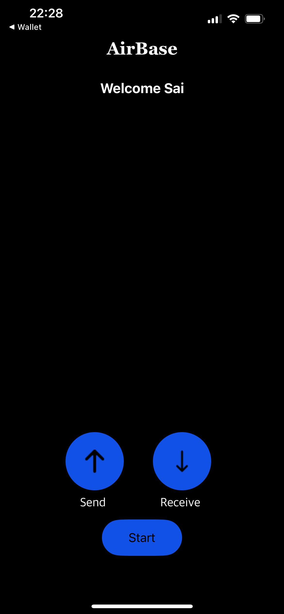

# AirBase

AirBase is an application that works in conjunction with **Coinbase Wallet** to send and receive crypto seamlessly without the need to share complex wallet addresses or scan annoying QR codes.

The integration with Coinbase Wallet is seamless, and sending and receiving crypto is as easy as sharing a picture using Airdrop.

## Features

- **Seamless Integration:** AirBase handles the process of discovering nearby entities and retrieving their Base Network Wallet addresses.
- **Cryptocurrency Support:** The application currently supports sending and receiving Ethereum on the Base Network. It is designed to be easily extended to support other cryptocurrencies and networks in the future.
- **Connectivity Requirements:** AirBase requires internet connectivity only from the sender's end. Future versions could be re-architected to require internet connectivity from either the sender or the receiver, enhancing the application's usability in areas with limited connectivity.

## AirBase In Action

- **Sender:** The sender initiates the transaction by selecting the recipient from the list of nearby devices. The sender then enters the amount to be sent and confirms the transaction.
- **Receiver:** The receiver broadcasts their public address to nearby devices. The sender selects the receiver from the list of nearby devices, and the transaction is initiated.

View the [Sender POV video](https://drive.google.com/file/d/1GqaN0pWE8gkfUaPbbsfnbiXTEhgNxvEo/view) to see AirBase Sender flow in action.

View the [Receiver POV video](https://drive.google.com/file/d/1Gwzr3xW_xrdz-yHNtdbLB8lZXVbwan2J/view) to see AirBase Receiver flow in action.

## Future Prospects

- AirBase can be adapted for use in day-to-day commerce, such as POS setups where the terminal requires connectivity but not the purchaser. This could enable millions across the world with limited connectivity to use crypto.

## AirBase in Action

## Challenges Faced

- **Secure Transmission:** Integrating Google Nearby to ensure public addresses are sent securely.
- **Technology Selection and Adaption:** Searching for the right technology involved great effort to assess and shortlist among multiple technologies. Adapting Google Nearby to fit our needs required meticulous attention to security and operational details.

## TO-DO

- **Receiver Confirmation:** The transaction confirmation page at the Receiver's end is currently hardcoded. This needs to be updated to show the actual transaction confirmation from the Block Explorer.